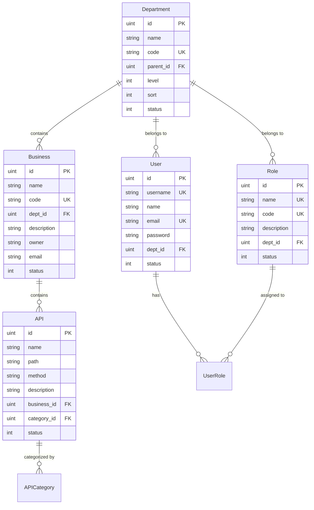
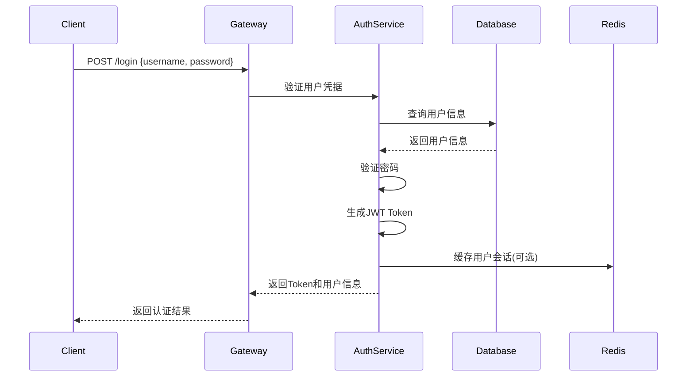
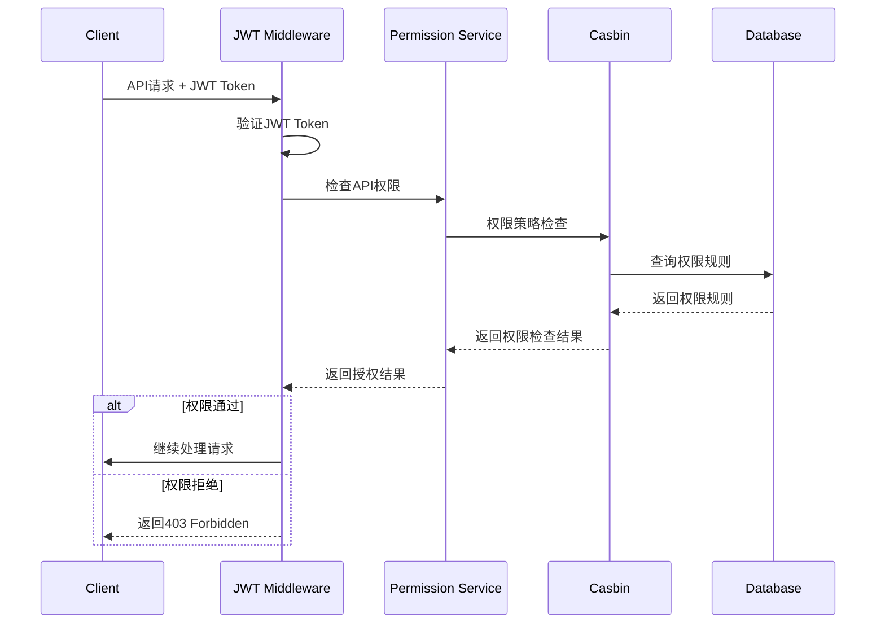

# API多租户授权管理系统架构文档

## 1. 系统概述

MCP RAPI是一个基于多租户架构的API权限管理系统，采用现代化的微服务设计理念，实现了细粒度的API访问控制和多层级的组织架构管理。系统通过部门隔离实现多租户，每个部门拥有独立的用户、角色、业务线和API资源，确保数据安全和权限隔离。

### 1.1 核心设计理念

- **多租户隔离**：基于部门的数据隔离，确保不同租户间的数据安全
- **RBAC权限模型**：基于角色的访问控制，支持细粒度权限管理
- **领域驱动设计**：采用DDD架构，清晰的业务边界和职责分离
- **RESTful API**：标准化的API设计，易于集成和扩展
- **JWT无状态认证**：支持分布式部署和水平扩展

## 2. 技术架构

### 2.1 整体架构图

```
┌─────────────────────────────────────────────────────────────┐
│                        前端层 (Frontend)                      │
├─────────────────────────────────────────────────────────────┤
│  Vue.js + Element UI + Vuex + Vue Router                   │
│  ┌─────────────┐ ┌─────────────┐ ┌─────────────┐           │
│  │  权限管理    │ │  用户管理    │ │  API管理     │           │
│  └─────────────┘ └─────────────┘ └─────────────┘           │
└─────────────────────────────────────────────────────────────┘
                              │
                         HTTP/HTTPS
                              │
┌─────────────────────────────────────────────────────────────┐
│                      传输层 (Transport)                      │
├─────────────────────────────────────────────────────────────┤
│  Gin Web Framework + JWT Middleware + CORS                 │
│  ┌─────────────┐ ┌─────────────┐ ┌─────────────┐           │
│  │  认证中间件   │ │  权限中间件   │ │  日志中间件   │           │
│  └─────────────┘ └─────────────┘ └─────────────┘           │
└─────────────────────────────────────────────────────────────┘
                              │
┌─────────────────────────────────────────────────────────────┐
│                      应用层 (Application)                    │
├─────────────────────────────────────────────────────────────┤
│  Handler + DTO + Service Orchestration                     │
│  ┌─────────────┐ ┌─────────────┐ ┌─────────────┐           │
│  │  用户处理器   │ │  权限处理器   │ │  API处理器    │           │
│  └─────────────┘ └─────────────┘ └─────────────┘           │
└─────────────────────────────────────────────────────────────┘
                              │
┌─────────────────────────────────────────────────────────────┐
│                      领域层 (Domain)                         │
├─────────────────────────────────────────────────────────────┤
│  Business Logic + Domain Services + Entities               │
│  ┌─────────────┐ ┌─────────────┐ ┌─────────────┐           │
│  │  认证服务    │ │  权限服务    │ │  部门服务     │           │
│  └─────────────┘ └─────────────┘ └─────────────┘           │
└─────────────────────────────────────────────────────────────┘
                              │
┌─────────────────────────────────────────────────────────────┐
│                    基础设施层 (Infrastructure)                │
├─────────────────────────────────────────────────────────────┤
│  GORM + MySQL + Redis + Casbin                             │
│  ┌─────────────┐ ┌─────────────┐ ┌─────────────┐           │
│  │  数据库      │ │  缓存        │ │  权限引擎     │           │
│  └─────────────┘ └─────────────┘ └─────────────┘           │
└─────────────────────────────────────────────────────────────┘
```

### 2.2 技术栈

#### 后端技术栈
- **框架**: Go 1.21 + Gin Web Framework
- **ORM**: GORM v2
- **数据库**: MySQL 8.0+
- **缓存**: Redis 6.0+
- **权限引擎**: Casbin
- **认证**: JWT (JSON Web Token)
- **配置管理**: Viper
- **容器化**: Docker + Docker Compose

#### 前端技术栈
- **框架**: Vue.js 2.x
- **UI组件**: Element UI
- **状态管理**: Vuex
- **路由**: Vue Router
- **HTTP客户端**: Axios
- **构建工具**: Vue CLI

## 3. 多租户设计模式

### 3.1 租户隔离策略

系统采用**基于部门的行级数据隔离**模式，实现多租户架构：

```
租户隔离层次：
集团 (Group)
├── 部门A (Department A) - 租户1
│   ├── 用户管理
│   ├── 角色管理  
│   ├── 业务线管理
│   └── API资源管理
├── 部门B (Department B) - 租户2
│   ├── 用户管理
│   ├── 角色管理
│   ├── 业务线管理
│   └── API资源管理
└── 部门C (Department C) - 租户3
    ├── 用户管理
    ├── 角色管理
    ├── 业务线管理
    └── API资源管理
```

### 3.2 数据模型设计

#### 核心实体关系



### 3.3 权限控制模型

#### RBAC权限模型

```
用户 (User) ←→ 角色 (Role) ←→ 权限 (Permission) ←→ 资源 (Resource)
     ↓              ↓              ↓              ↓
   部门隔离        部门隔离        API级别        业务线/API
```

#### 权限层级

1. **部门级权限**: 控制用户只能访问所属部门的资源
2. **角色级权限**: 基于角色分配功能权限
3. **API级权限**: 细粒度的API访问控制
4. **业务线权限**: 业务线级别的资源隔离

## 4. 系统架构详解

### 4.1 领域驱动设计 (DDD)

#### 领域划分

```
┌─────────────────────────────────────────────────────────────┐
│                      认证授权域                              │
│  ┌─────────────┐ ┌─────────────┐ ┌─────────────┐           │
│  │  用户管理    │ │  角色管理    │ │  权限验证     │           │
│  └─────────────┘ └─────────────┘ └─────────────┘           │
└─────────────────────────────────────────────────────────────┘

┌─────────────────────────────────────────────────────────────┐
│                      组织管理域                              │
│  ┌─────────────┐ ┌─────────────┐ ┌─────────────┐           │
│  │  部门管理    │ │  业务线管理   │ │  层级管理     │           │
│  └─────────────┘ └─────────────┘ └─────────────┘           │
└─────────────────────────────────────────────────────────────┘

┌─────────────────────────────────────────────────────────────┐
│                      API管理域                              │
│  ┌─────────────┐ ┌─────────────┐ ┌─────────────┐           │
│  │  API注册     │ │  分类管理    │ │  访问控制     │           │
│  └─────────────┘ └─────────────┘ └─────────────┘           │
└─────────────────────────────────────────────────────────────┘
```

#### 核心服务

1. **AuthService**: 认证授权服务
   - 用户登录/登出
   - JWT Token生成和验证
   - 权限检查

2. **DepartmentService**: 部门管理服务
   - 部门CRUD操作
   - 层级管理
   - 租户隔离

3. **UserService**: 用户管理服务
   - 用户CRUD操作
   - 角色分配
   - 部门关联

4. **RoleService**: 角色管理服务
   - 角色CRUD操作
   - 权限分配
   - 部门隔离

5. **APIService**: API管理服务
   - API注册和管理
   - 分类管理
   - 访问统计

6. **BusinessService**: 业务线管理服务
   - 业务线CRUD操作
   - 部门关联
   - API归属

### 4.2 认证授权流程

#### 登录认证流程



#### API权限验证流程



### 4.3 前端架构设计

#### 组件架构

```
src/
├── api/                    # API请求封装
│   ├── auth.js            # 认证相关API
│   ├── user.js            # 用户管理API
│   ├── role.js            # 角色管理API
│   ├── department.js      # 部门管理API
│   ├── business.js        # 业务线管理API
│   └── api.js             # API管理API
├── components/             # 公共组件
│   ├── Pagination/        # 分页组件
│   └── SvgIcon/           # 图标组件
├── layout/                 # 布局组件
│   ├── components/        # 布局子组件
│   └── index.vue          # 主布局
├── router/                 # 路由配置
│   └── index.js           # 路由定义
├── store/                  # 状态管理
│   ├── modules/           # 模块化状态
│   │   ├── user.js        # 用户状态
│   │   ├── permission.js  # 权限状态
│   │   └── tagsView.js    # 标签页状态
│   └── index.js           # 状态入口
├── utils/                  # 工具函数
│   ├── auth.js            # 认证工具
│   ├── request.js         # HTTP请求封装
│   └── permission.js      # 权限工具
└── views/                  # 页面组件
    ├── login/             # 登录页面
    ├── dashboard/         # 仪表盘
    ├── system/            # 系统管理
    │   ├── user/          # 用户管理
    │   ├── role/          # 角色管理
    │   ├── department/    # 部门管理
    │   └── menu-permission/ # 菜单权限
    └── api/               # API管理
```

#### 权限控制机制

1. **路由级权限**: 基于用户角色动态生成路由
2. **组件级权限**: 通过指令控制组件显示
3. **按钮级权限**: 细粒度的操作权限控制
4. **数据级权限**: 基于部门的数据过滤

## 5. 核心功能模块

### 5.1 多租户管理

#### 部门管理
- 支持多级部门层次结构
- 部门独立的用户和角色管理
- 部门级别的数据隔离
- 部门权限继承机制

#### 业务线管理
- 业务线与部门的关联
- 业务线级别的API归属
- 业务线负责人管理
- 业务线状态控制

### 5.2 用户权限管理

#### 用户管理
- 用户基本信息管理
- 部门归属管理
- 用户状态控制
- 密码安全策略

#### 角色管理
- 角色定义和描述
- 角色与部门的关联
- 角色权限分配
- 角色状态管理

#### 权限分配
- 基于角色的权限分配
- API级别的细粒度权限
- 菜单权限控制
- 数据权限隔离

### 5.3 API资源管理

#### API注册
- API基本信息管理
- HTTP方法和路径定义
- API分类管理
- API状态控制

#### 权限控制
- API访问权限配置
- 基于角色的API授权
- API调用统计
- 访问日志记录

### 5.4 监控统计

#### 仪表盘
- 部门API统计
- 业务线API分布
- 用户访问统计
- 权限使用分析

## 6. 安全设计

### 6.1 认证安全

- **JWT Token**: 无状态认证，支持分布式部署
- **Token过期**: 24小时自动过期，支持刷新
- **密码加密**: BCrypt加密存储
- **登录保护**: 防暴力破解机制

### 6.2 授权安全

- **最小权限原则**: 用户只能访问必要的资源
- **权限继承**: 支持角色权限继承
- **动态权限**: 支持运行时权限变更
- **审计日志**: 完整的权限操作记录

### 6.3 数据安全

- **多租户隔离**: 严格的部门级数据隔离
- **SQL注入防护**: 使用ORM防止SQL注入
- **XSS防护**: 前端输入验证和转义
- **CSRF防护**: Token验证机制

## 7. 部署架构

### 7.1 容器化部署

```yaml
# docker-compose.yml
version: '3.8'
services:
  frontend:
    build: ./frontend
    ports:
      - "80:80"
    depends_on:
      - backend
      
  backend:
    build: ./backend
    ports:
      - "8080:8080"
    depends_on:
      - mysql
      - redis
      
  mysql:
    image: mysql:8.0
    environment:
      MYSQL_ROOT_PASSWORD: ${MYSQL_ROOT_PASSWORD}
      MYSQL_DATABASE: mcprapi
      
  redis:
    image: redis:6.0-alpine
    ports:
      - "6379:6379"
```

### 7.2 生产环境架构

```
┌─────────────────────────────────────────────────────────────┐
│                        负载均衡器                            │
│                     (Nginx/HAProxy)                        │
└─────────────────────────────────────────────────────────────┘
                              │
                    ┌─────────┴─────────┐
                    │                   │
┌─────────────────────────┐   ┌─────────────────────────┐
│      前端集群            │   │      后端集群            │
│   (Frontend Cluster)   │   │   (Backend Cluster)    │
│  ┌─────┐ ┌─────┐ ┌─────┐│   │  ┌─────┐ ┌─────┐ ┌─────┐│
│  │ Web │ │ Web │ │ Web ││   │  │ API │ │ API │ │ API ││
│  │  1  │ │  2  │ │  3  ││   │  │  1  │ │  2  │ │  3  ││
│  └─────┘ └─────┘ └─────┘│   │  └─────┘ └─────┘ └─────┘│
└─────────────────────────┘   └─────────────────────────┘
                                          │
                              ┌───────────┴───────────┐
                              │                       │
                    ┌─────────────────┐   ┌─────────────────┐
                    │   MySQL集群      │   │   Redis集群      │
                    │  (主从复制)      │   │  (哨兵模式)      │
                    └─────────────────┘   └─────────────────┘
```

## 8. 扩展性设计

### 8.1 水平扩展

- **无状态设计**: 后端服务无状态，支持水平扩展
- **数据库分片**: 支持按部门分片的数据库扩展
- **缓存集群**: Redis集群支持高并发访问
- **微服务拆分**: 支持按业务域拆分微服务

### 8.2 功能扩展

- **插件机制**: 支持权限策略插件扩展
- **API网关**: 支持接入API网关进行统一管理
- **监控告警**: 支持接入监控系统
- **审计系统**: 支持完整的操作审计

## 9. 最佳实践

### 9.1 开发规范

- **代码规范**: 遵循Go和Vue.js最佳实践
- **API设计**: RESTful API设计规范
- **数据库设计**: 规范化的数据库设计
- **错误处理**: 统一的错误处理机制

### 9.2 运维规范

- **配置管理**: 环境变量和配置文件管理
- **日志管理**: 结构化日志和集中式日志收集
- **监控告警**: 应用性能监控和告警机制
- **备份恢复**: 数据备份和灾难恢复策略

## 10. 总结

MCP RAPI多租户授权管理系统采用现代化的架构设计，通过部门级数据隔离实现多租户，基于RBAC模型提供细粒度权限控制。系统具有良好的扩展性、安全性和可维护性，能够满足企业级应用的需求。

### 核心优势

1. **多租户隔离**: 基于部门的严格数据隔离
2. **细粒度权限**: API级别的权限控制
3. **现代化架构**: DDD + 微服务架构设计
4. **高可扩展性**: 支持水平扩展和功能扩展
5. **安全可靠**: 完善的安全机制和审计功能

### 适用场景

- 企业内部API管理平台
- 多部门协作的权限管理系统
- SaaS平台的租户管理
- 微服务架构的权限中心