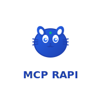

<div align="center">
  

# 🔧 MCP RAPI

  **Modern API Permission Management System with MCP Integration**

  [](https://golang.org/)
  [](https://vuejs.org/)
  [](LICENSE)
  [](https://docker.com/)
  [](https://modelcontextprotocol.io/)

  [🎯 Features](#-features) • [🚀 Quick Start](#-quick-start) • [📖 Documentation](#-documentation) • [🤝 Contributing](#-contributing) • [🌟 Star History](#-star-history)

</div>

---

## 💡 What is MCP RAPI?

**MCP RAPI** (Model Context Protocol - Role-based API) is a **modern, enterprise-grade API permission management system** built with Go and Vue.js, designed specifically for **MCP (Model Context Protocol)** environments. It provides comprehensive RBAC (Role-Based Access Control) capabilities for managing API access permissions across your organization with seamless MCP integration.

### 🎯 Perfect for:

- **🤖 AI/LLM Applications** - MCP-compatible API permission management
- **🏗️ Microservices Architecture** - Centralized API permission control
- **🏢 Enterprise Applications** - Multi-tenant permission management
- **👥 Development Teams** - Streamlined API access workflows
- **🔄 DevOps Automation** - Automated permission deployment

## ⚡ Key Features

<table>
<tr>
<td width="50%">

## 🛠️ Tech Stack

<div align="center">

### Backend


### Frontend


### DevOps & Infrastructure


</div>

## 📁 Project Structure

```
📦 mcp-rapi/
├── 🔧 backend/                 # Go Backend Service
│   ├── 🚀 cmd/                 # Application Entry Point
│   │   └── main.go            # Main application
│   ├── ⚙️  configs/             # Configuration Files
│   │   ├── dev.yaml           # Development config
│   │   ├── prod.yaml          # Production config
│   │   └── casbin_model.conf  # Casbin RBAC model
│   ├── 🏗️  internal/            # Internal Application Code
│   │   ├── 🎯 domain/          # Business Domain Layer
│   │   │   ├── 📋 entity/      # Domain Entities
│   │   │   ├── 🗄️  repository/  # Repository Interfaces
│   │   │   └── 🔧 service/     # Business Services
│   │   ├── 🏭 infrastructure/  # Infrastructure Layer
│   │   │   ├── 💾 cache/       # Redis Cache Implementation
│   │   │   ├── 📦 container/   # Dependency Injection
│   │   │   ├── 🗃️  database/    # Database Connection
│   │   │   └── 🗄️  repository/  # Repository Implementation
│   │   ├── 🛠️  pkg/            # Internal Utilities
│   │   └── 🌐 transport/       # Transport Layer
│   │       ├── 🔗 http/        # HTTP Handlers
│   │       └── 🔒 middleware/  # HTTP Middleware
│   ├── 📚 pkg/                 # Public Utilities
│   │   └── casbinx/           # Casbin Extensions
│   └── 📜 scripts/             # Utility Scripts
│       └── init_admin.go      # Admin Initialization
├── 🎨 frontend/                # Vue.js Frontend
│   ├── 🌍 public/              # Static Assets
│   ├── 📝 src/                 # Source Code
│   │   ├── 🔌 api/             # API Client
│   │   ├── 🎭 assets/          # Assets
│   │   ├── 🧩 components/      # Vue Components
│   │   ├── 🗺️  router/          # Vue Router Configuration
│   │   ├── 🗃️  store/           # Vuex Store
│   │   ├── 🎨 styles/          # Global Styles
│   │   ├── 🛠️  utils/           # Utility Functions
│   │   └── 👁️  views/           # Vue Views/Pages
│   ├── 📦 package.json         # NPM Dependencies
│   └── ⚙️  vue.config.js        # Vue CLI Configuration
├── 🐳 docker-compose.yml       # Docker Compose Configuration
├── 🐳 docker-compose.dev.yml   # Development Docker Compose
├── 📄 .env.example             # Environment Variables Template
├── 🎨 assets/                  # Project Assets
│   └── logo.svg               # Project Logo
├── 📚 docs/                    # Documentation
└── 🔧 mcp-example/             # MCP Integration Examples
    ├── fastmcp_http_server.py # FastMCP HTTP Server
    ├── requirements.txt       # Python Dependencies
    └── start_fastmcp_http_server.sh # Startup Script
```

## 🚀 Quick Start

### 🐳 One-Click Docker Setup (Recommended)

Get up and running in under 2 minutes:

```bash
# 1. Clone the repository
git clone https://github.com/chuangyeshuo/mcprapi.git
cd mcprapi

# 2. Start development environment (with hot reload & admin tools)
docker-compose -f docker-compose.dev.yml up -d

# 3. Check service status
docker-compose -f docker-compose.dev.yml ps

# 🎉 Your MCP RAPI system is now running!
```

**🌐 Access URLs:**
- **Frontend Dashboard**: http://localhost:8082
- **Backend API**: http://localhost:8081
- **API Documentation**: http://localhost:8081/swagger/index.html
- **Health Check**: http://localhost:8081/health
- **Database Admin**: http://localhost:8083 (Adminer)
- **Redis Admin**: http://localhost:8084 (Redis Commander)

**🔑 Default Login:**
```
Username: admin
Password: admin
```

> ⚠️ **Security Note**: Please change the default password immediately after first login!

### 🏭 Production Deployment

```bash
# 1. Configure environment variables
cp .env.example .env
# Edit .env file with your production settings

# 2. Start production environment
docker-compose up -d

# 3. Check service status
docker-compose ps
```

**Production URLs:**
- **Frontend**: http://localhost:8082
- **Backend API**: http://localhost:8081
- **API Documentation**: http://localhost:8081/swagger/index.html
- **Health Check**: http://localhost:8081/health

### 💻 Local Development Setup

<details>
<summary><b>📋 Prerequisites</b></summary>

- **Go** 1.21+ ([Download](https://golang.org/dl/))
- **Node.js** 18+ ([Download](https://nodejs.org/))
- **MySQL** 8.0+ ([Download](https://dev.mysql.com/downloads/))
- **Redis** 6.0+ ([Download](https://redis.io/download))
- **Python** 3.8+ (for MCP integration)

</details>

#### 🔧 Backend Setup

```bash
# Navigate to backend directory
cd backend

# Install Go dependencies
go mod download

# Copy and edit configuration
cp configs/dev.yaml.example configs/dev.yaml
# Edit configs/dev.yaml with your database settings

# Initialize database (creates admin user)
go run scripts/init_admin.go

# Start the backend server with hot reload
go run cmd/main.go --config configs/dev.yaml

# 🚀 Backend running on http://localhost:8081
```

#### 🎨 Frontend Setup

```bash
# Navigate to frontend directory
cd frontend

# Install Node.js dependencies
npm install

# Start development server with hot reload
npm run serve

# 🎨 Frontend running on http://localhost:8080
```

#### 🤖 MCP Server Setup (Optional)

```bash
# Navigate to MCP example directory
cd mcp-example

# Install Python dependencies
pip install -r requirements.txt

# Start FastMCP HTTP server
./start_fastmcp_http_server.sh

# 🤖 MCP Server running on http://localhost:8080
```

## 📖 Documentation

### 🔗 API Documentation

Interactive API documentation is available once the system is running:

**📚 Swagger UI**: [http://localhost:8081/swagger/index.html](http://localhost:8081/swagger/index.html)

### 🔑 Default Credentials

```
👤 Username: admin
🔒 Password: admin
```

> ⚠️ **Security Note**: Please change the default password immediately after first login!

### 📚 Additional Resources

- [🚀 Quick Start Guide](QUICK_START.md) - **Start here for fastest setup!**
- [🏗️ System Architecture](API多租户授权管理系统架构文档.md)
- [🗃️ Database Setup Guide](DATABASE_INIT.md)
- [🐳 Docker Deployment Guide](DOCKER_DEPLOYMENT.md)
- [🏢 Department Management](新增部门流程文档.md)
- [🤖 MCP Integration Guide](mcp-example/FASTMCP_HTTP_CONFIG.md)

## 🌟 Key Capabilities

### 🔐 Permission Management

- **Fine-grained Control**: API-level permission management
- **Role-based Access**: Hierarchical role system
- **Dynamic Updates**: Real-time permission changes
- **Audit Trail**: Complete permission history

### 🏢 Multi-tenant Architecture

- **Organization Isolation**: Complete data separation
- **Department Hierarchy**: Multi-level organizational structure
- **Business Line Support**: Cross-department collaboration
- **Scalable Design**: Supports thousands of users

### 🤖 MCP Integration

- **Native Support**: Built-in MCP protocol compatibility
- **AI-Ready**: Perfect for LLM and AI applications
- **Context Management**: Intelligent context handling
- **Protocol Compliance**: Full MCP specification support

## 🤝 Contributing

We welcome contributions from the community! Here's how you can help make MCP RAPI even better:

### 🐛 Bug Reports

Found a bug? Please create an issue with:

- **Clear Description**: What went wrong?
- **Reproduction Steps**: How can we reproduce it?
- **Expected Behavior**: What should have happened?
- **Environment**: OS, browser, versions, etc.

### 💡 Feature Requests

Have a great idea? We'd love to hear it! Please include:

- **Use Case**: Why is this feature needed?
- **Proposed Solution**: How should it work?
- **Examples**: Any relevant examples or mockups

### 🔧 Development Workflow

1. **Fork** the repository
2. **Create** a feature branch (`git checkout -b feature/amazing-feature`)
3. **Commit** your changes (`git commit -m 'feat: add amazing feature'`)
4. **Push** to the branch (`git push origin feature/amazing-feature`)
5. **Open** a Pull Request

### 📝 Code Standards

- **Go**: Follow [Go Code Review Comments](https://github.com/golang/go/wiki/CodeReviewComments)
- **Vue.js**: Follow [Vue.js Style Guide](https://vuejs.org/style-guide/)
- **Commits**: Use [Conventional Commits](https://www.conventionalcommits.org/)
- **Testing**: Include tests for new features
- **Documentation**: Update docs for API changes

## 🌟 Star History

[](https://star-history.com/#yourusername/mcp-rapi&Date)

## 🚀 Roadmap

- [ ] **GraphQL API Support** - Alternative to REST APIs
- [ ] **Advanced Analytics** - Permission usage insights
- [ ] **SSO Integration** - SAML, OAuth2, OIDC support
- [ ] **Mobile App** - Native mobile management app
- [ ] **Kubernetes Operator** - K8s native deployment
- [ ] **Advanced MCP Features** - Enhanced protocol support

## 📄 License

This project is licensed under the **MIT License** - see the [LICENSE](LICENSE) file for details.

## 🙏 Acknowledgments

Special thanks to these amazing projects that make MCP RAPI possible:

- [🔐 Casbin](https://casbin.org/) - Authorization library that powers our RBAC
- [🌐 Gin](https://gin-gonic.com/) - High-performance HTTP web framework
- [🎨 Vue.js](https://vuejs.org/) - Progressive JavaScript framework
- [🧩 Element UI](https://element.eleme.io/) - Beautiful Vue.js component library
- [🤖 Model Context Protocol](https://modelcontextprotocol.io/) - AI context management standard

## 💬 Community & Support

- **💬 Discussions**: [GitHub Discussions](https://github.com/yourusername/mcp-rapi/discussions)
- **🐛 Issues**: [GitHub Issues](https://github.com/yourusername/mcp-rapi/issues)
- **📧 Email**: support@mcp-rapi.com
- **📱 Discord**: [Join our Discord](https://discord.gg/mcp-rapi)

---

<div align="center">

**Made with ❤️ by the MCP RAPI Community**

[⭐ Star us on GitHub](https://github.com/yourusername/mcp-rapi) • [🐛 Report Bug](https://github.com/yourusername/mcp-rapi/issues) • [💡 Request Feature](https://github.com/yourusername/mcp-rapi/issues) • [💬 Join Discussion](https://github.com/yourusername/mcp-rapi/discussions)

**🚀 Ready to revolutionize your API permission management? Get started now!**

</div>
