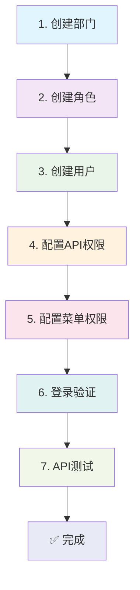

# MCP RAPI 管理系统 - 新增部门完整流程指南

> 📖 本文档提供了在 MCP RAPI 管理系统中新增部门的完整操作指南，包括部门创建、权限配置、用户管理等全流程步骤。

## 📋 流程概览

### 🔄 操作流程图

```
┌─────────────┐    ┌─────────────┐    ┌─────────────┐    ┌─────────────┐
│ 1. 创建部门  │───▶│ 2. 创建角色  │───▶│ 3. 创建用户  │───▶│ 4. 配置API权限│
└─────────────┘    └─────────────┘    └─────────────┘    └─────────────┘
                                                                   │
┌─────────────┐    ┌─────────────┐    ┌─────────────┐    ┌─────────────┐
│ ✅ 完成     │◀───│ 7. API测试   │◀───│ 6. 登录验证  │◀───│ 5. 配置菜单权限│
└─────────────┘    └─────────────┘    └─────────────┘    └─────────────┘
```

### 📝 详细步骤列表

1. **🏢 创建部门** → 建立组织架构基础
2. **👥 创建角色** → 定义权限角色模板  
3. **👤 创建用户** → 添加具体操作人员
4. **🔐 配置API权限** → 设置后端接口访问权限
5. **🎛️ 配置菜单权限** → 设置前端页面访问权限
6. **🌐 登录验证** → 验证用户登录和基础功能
7. **🧪 API测试** → 测试接口权限是否正确
8. **✅ 完成** → 部门创建流程结束

### 🔄 Mermaid 流程图（支持 Mermaid 的编辑器可查看）



### 🎯 预计完成时间
- **总时长**：15-20分钟
- **难度等级**：⭐⭐⭐☆☆（中等）

---

## 🏢 步骤1：创建部门

### 📍 操作路径
**系统管理** → **部门管理** → **新增**

### 📝 填写信息
| 字段 | 示例值 | 说明 | 必填 |
|------|--------|------|------|
| 部门名称 | `AI研发部` | 部门的显示名称 | ✅ |
| 部门代码 | `aigc` | 部门唯一标识符（英文/数字） | ✅ |
| 上级部门 | `技术中心` | 选择上级部门（可选） | ❌ |
| 部门描述 | `负责AI产品研发` | 部门职能描述 | ❌ |
| 排序 | `10` | 显示顺序 | ❌ |
| 状态 | `启用` | 部门状态 | ✅ |

### ✅ 验证结果
- 部门列表中显示新创建的部门
- 部门代码唯一性检查通过

---

## 👥 步骤2：创建角色

### 📍 操作路径
**系统管理** → **角色管理** → **新增**

### 📝 填写信息
| 字段 | 示例值 | 说明 | 必填 |
|------|--------|------|------|
| 角色名称 | `AI研发工程师` | 角色的显示名称 | ✅ |
| 角色代码 | `aigc_engineer` | 角色唯一标识符 | ✅ |
| 所属部门 | `AI研发部` | 选择对应部门 | ✅ |
| 角色描述 | `AI研发相关工作权限` | 角色职责描述 | ❌ |
| 状态 | `启用` | 角色状态 | ✅ |

### 💡 命名建议
- 角色代码建议格式：`{部门代码}_{职位}`
- 例如：`aigc_engineer`、`aigc_manager`、`aigc_intern`

### ✅ 验证结果
- 角色列表中显示新创建的角色
- 角色与部门关联正确

---

## 👤 步骤3：创建用户

### 📍 操作路径
**系统管理** → **用户管理** → **新增**

### 📝 填写信息
| 字段 | 示例值 | 说明 | 必填 |
|------|--------|------|------|
| 用户名 | `aigc_user` | 登录用户名（英文/数字） | ✅ |
| 姓名 | `张三` | 用户真实姓名 | ✅ |
| 密码 | `Abc123456!` | 登录密码（建议8位以上） | ✅ |
| 确认密码 | `Abc123456!` | 再次输入密码 | ✅ |
| 邮箱 | `zhangsan@company.com` | 用户邮箱地址 | ✅ |
| 手机号 | `13800138000` | 联系电话 | ❌ |
| 所属部门 | `AI研发部` | 选择对应部门 | ✅ |
| 角色 | `AI研发工程师` | 选择对应角色 | ✅ |
| 状态 | `启用` | 用户状态 | ✅ |

### 🔒 密码要求
- 长度：8-20位
- 包含：大小写字母、数字、特殊字符
- 避免：弱密码如 `123456`、`password`

### ✅ 验证结果
- 用户列表中显示新创建的用户
- 用户与部门、角色关联正确

---

## 🔐 步骤4：配置API权限

### 方式一：使用管理界面（推荐）

#### 📍 操作路径
**权限管理** → **API权限** → **角色权限配置**

#### 📝 配置步骤
1. 选择角色：`AI研发工程师`
2. 配置API权限：

| API路径 | 方法 | 权限 | 说明 |
|---------|------|------|------|
| `/api/v1/apis*` | `*` | `允许` | API管理权限 |
| `/api/v1/business*` | `*` | `允许` | 业务线管理权限 |
| `/api/v1/departments*` | `GET` | `允许` | 部门查看权限 |
| `/api/v1/users*` | `GET,POST,PUT` | `允许` | 用户管理权限 |

### 方式二：数据库直接配置

```sql
-- 连接数据库
USE api_auth_dev;

-- 添加API权限规则
INSERT INTO casbin_rule (ptype, v0, v1, v2, v3, v4, v5) VALUES 
('p', 'aigc_engineer', '/api/v1/apis*', '*', '*', 'allow', ''),
('p', 'aigc_engineer', '/api/v1/apis/*', '*', '*', 'allow', ''),
('p', 'aigc_engineer', '/api/v1/business*', '*', '*', 'allow', ''),
('p', 'aigc_engineer', '/api/v1/business/*', '*', '*', 'allow', ''),
('p', 'aigc_engineer', '/api/v1/departments*', 'GET', '*', 'allow', ''),
('p', 'aigc_engineer', '/api/v1/users*', 'GET,POST,PUT', '*', 'allow', '');

-- 验证权限配置
SELECT * FROM casbin_rule WHERE v0='aigc_engineer';
```

### ✅ 验证结果
- Casbin规则表中存在对应权限记录
- 权限配置界面显示正确

---

## 🎛️ 步骤5：配置菜单权限

### 📍 操作路径
**权限管理** → **菜单权限** → **角色菜单配置**

### 📝 配置菜单
选择角色 `AI研发工程师`，勾选以下菜单：

#### 🏠 主要功能模块
- ✅ **业务管理**
  - ✅ 业务线列表
  - ✅ 业务线创建
  - ✅ 业务线编辑
- ✅ **API管理**
  - ✅ API列表
  - ✅ API创建
  - ✅ API编辑
  - ✅ API授权
- ✅ **用户管理**
  - ✅ 用户列表
  - ✅ 用户查看

#### 🔧 系统功能（可选）
- ❌ 部门管理（通常不开放）
- ❌ 角色管理（通常不开放）
- ❌ 系统设置（通常不开放）

### ✅ 验证结果
- 菜单权限配置保存成功
- 角色菜单关联正确

---

## 🌐 步骤6：登录验证

### 📍 访问地址
```
前端管理界面：http://localhost:8082/
后端API服务：http://localhost:8081/
```

### 📝 登录测试
1. **打开管理界面**：`http://localhost:8082/`
2. **输入登录信息**：
   - 用户名：`aigc_user`
   - 密码：`Abc123456!`
3. **验证菜单显示**：
   - 检查是否显示配置的菜单
   - 验证无权限菜单是否隐藏

### 🔍 功能验证清单
- [ ] 登录成功
- [ ] 用户信息显示正确
- [ ] 菜单权限生效
- [ ] 页面访问正常

### ✅ 验证结果
- 用户可以正常登录系统
- 菜单显示符合权限配置

---

## 🔑 步骤7：API Token获取

### 方式一：管理界面生成（推荐）

#### 📍 操作路径
**用户管理** → **选择用户** → **Token按钮**

#### 📝 操作步骤
1. **进入用户管理页面**：在左侧菜单选择"用户管理"
2. **找到目标用户**：在用户列表中找到 `aigc_user`
3. **点击Token按钮**：在操作列点击绿色的"Token"按钮
4. **查看Token信息**：
   - 用户信息：显示用户名和邮箱
   - JWT Token：完整的访问令牌
   - 操作选项：刷新Token、刷新Token+版本号

#### 🖼️ 界面说明
```
用户Token管理
├── 用户：李迪 (lidi10)
├── 邮箱：lidi10@126.com
├── JWT Token：
│   └── [长文本框显示完整Token]
└── 操作按钮：
    ├── 刷新Token
    ├── 刷新Token+版本号
    └── 关闭
```

#### 💡 Token操作说明
- **刷新Token**：生成新的Token，保持相同版本号
- **刷新Token+版本号**：生成新Token并更新版本号（会使旧Token失效）
- **复制Token**：直接从文本框复制完整Token

### 方式二：API接口获取（备选）

#### 📝 curl命令
```bash
curl -X POST \
  -H "Content-Type: application/json" \
  -d '{
    "username": "aigc_user",
    "password": "Abc123456!"
  }' \
  http://localhost:8081/api/v1/auth/login
```

#### 📋 响应示例
```json
{
  "code": 200,
  "message": "登录成功",
  "data": {
    "token": "eyJhbGciOiJIUzI1NiIsInR5cCI6IkpXVCJ9...",
    "user": {
      "id": 10,
      "username": "aigc_user",
      "name": "张三",
      "department": "AI研发部",
      "role": "AI研发工程师"
    },
    "expires_at": "2024-01-27T10:30:00Z"
  }
}
```

### 💾 保存Token

#### 🖥️ 环境变量方式（推荐）
```bash
# 保存Token到环境变量
export API_TOKEN="eyJhbGciOiJIUzI1NiIsInR5cCI6IkpXVCJ9..."

# 验证环境变量
echo $API_TOKEN
```

#### 📁 文件保存方式
```bash
# 保存到文件
echo "eyJhbGciOiJIUzI1NiIsInR5cCI6IkpXVCJ9..." > token.txt

# 从文件读取
API_TOKEN=$(cat token.txt)
```

#### 📋 配置文件方式
```bash
# 创建配置文件
cat > api_config.sh << EOF
#!/bin/bash
export API_TOKEN="eyJhbGciOiJIUzI1NiIsInR5cCI6IkpXVCJ9..."
export API_BASE_URL="http://localhost:8081"
EOF

# 加载配置
source api_config.sh
```

### ✅ 验证结果
- ✅ 成功获取有效的JWT Token
- ✅ Token包含正确的用户信息
- ✅ Token可以正常保存和使用

---

## 🧪 步骤8：API权限测试

### 🔍 权限检查测试
```bash
# 使用环境变量中的Token
curl -s -X POST \
  -H "Content-Type: application/json" \
  -H "Authorization: Bearer $API_TOKEN" \
  -d '{
    "api_path": "/api/v1/apis",
    "method": "GET"
  }' \
  http://localhost:8081/api/v1/api/check-permission
```

### 📋 预期响应
```json
{
  "code": 200,
  "message": "权限检查成功",
  "data": {
    "allowed": true,
    "reason": "用户具有访问权限",
    "user": "aigc_user",
    "role": "aigc_engineer",
    "resource": "/api/v1/apis",
    "action": "GET"
  }
}
```

### 🧪 功能API测试
```bash
# 测试业务线列表API
curl -H "Authorization: Bearer $API_TOKEN" \
  http://localhost:8081/api/v1/business

# 测试API列表API
curl -H "Authorization: Bearer $API_TOKEN" \
  http://localhost:8081/api/v1/apis

# 测试用户信息API
curl -H "Authorization: Bearer $API_TOKEN" \
  http://localhost:8081/api/v1/user/profile
```

### ✅ 验证结果
- API权限检查通过
- 功能API调用成功
- 无权限API被正确拒绝

---

## 📊 完成状态检查

### ✅ 流程完成检查清单

| 步骤 | 任务 | 状态 | 验证方法 |
|------|------|------|----------|
| 1 | 部门创建 | ⬜ | 部门列表中可见 |
| 2 | 角色创建 | ⬜ | 角色列表中可见 |
| 3 | 用户创建 | ⬜ | 用户列表中可见 |
| 4 | API权限配置 | ⬜ | 数据库权限记录存在 |
| 5 | 菜单权限配置 | ⬜ | 前端菜单显示正确 |
| 6 | 登录验证 | ⬜ | 用户可正常登录 |
| 7 | Token获取 | ⬜ | API返回有效Token |
| 8 | API权限测试 | ⬜ | 权限检查通过 |

### 🎯 成功标准
- ✅ 所有检查项目均为完成状态
- ✅ 用户可以正常使用分配的功能
- ✅ 权限控制按预期工作

---

## ⚠️ 注意事项与最佳实践

### 🔒 安全建议
1. **密码策略**
   - 生产环境使用强密码
   - 定期更换密码
   - 启用密码复杂度要求

2. **权限最小化原则**
   - 只授予必要的API访问权限
   - 定期审查用户权限
   - 及时回收离职人员权限

3. **Token安全**
   - 妥善保管访问令牌
   - 设置合理的过期时间
   - 避免在日志中记录Token

### 🔧 故障排除

| 问题 | 可能原因 | 解决方案 | 检查命令 |
|------|----------|----------|----------|
| 登录失败 | 用户名/密码错误 | 检查用户信息，重置密码 | `SELECT * FROM users WHERE username='aigc_user';` |
| 菜单不显示 | 菜单权限未配置 | 检查角色菜单权限设置 | 在管理界面检查菜单权限配置 |
| API访问被拒绝 | API权限未配置 | 检查Casbin权限规则 | `SELECT * FROM casbin_rule WHERE v0='aigc_engineer';` |
| Token无效 | Token过期或格式错误 | 重新获取Token | 在用户管理页面刷新Token |
| 页面404错误 | 路由权限问题 | 检查前端路由权限配置 | 检查浏览器控制台错误信息 |
| 部门代码重复 | 部门代码已存在 | 使用唯一的部门代码 | `SELECT * FROM departments WHERE code='aigc';` |
| 角色创建失败 | 角色代码重复 | 使用唯一的角色代码 | `SELECT * FROM roles WHERE code='aigc_engineer';` |
| 权限不生效 | 缓存未刷新 | 重启后端服务或清除缓存 | `curl http://localhost:8081/api/v1/auth/reload-policy` |

### 📞 技术支持

#### 🔍 健康检查
```bash
# 检查后端服务状态
curl http://localhost:8081/health

# 检查前端服务状态
curl http://localhost:8082/

# 检查数据库连接
mysql -u root -plidi10 -h localhost -e "SELECT 1"
```

#### 📋 日志查看
```bash
# 查看后端日志
tail -f backend/logs/api-auth.log

# 查看系统日志
journalctl -u mcprapi-backend -f
```

#### 📧 联系方式
- **技术文档**：查看项目README.md
- **问题反馈**：提交GitHub Issue
- **紧急支持**：联系系统管理员

---

## 🚀 快速操作指南

### ⚡ 一键创建部门脚本

创建一个快速部门创建脚本：

```bash
#!/bin/bash
# 文件名：create_department.sh

# 配置参数
DEPT_NAME="$1"
DEPT_CODE="$2"
USER_NAME="$3"
USER_PASSWORD="$4"
USER_EMAIL="$5"

# 检查参数
if [ $# -ne 5 ]; then
    echo "使用方法: $0 <部门名称> <部门代码> <用户名> <密码> <邮箱>"
    echo "示例: $0 'AI研发部' 'aigc' 'aigc_user' 'Abc123456!' 'user@company.com'"
    exit 1
fi

echo "🏢 开始创建部门: $DEPT_NAME ($DEPT_CODE)"
echo "👤 创建用户: $USER_NAME"
echo "📧 邮箱: $USER_EMAIL"
echo ""

# 这里可以添加自动化创建逻辑
# 1. 调用API创建部门
# 2. 创建角色
# 3. 创建用户
# 4. 配置权限

echo "✅ 部门创建完成！"
echo "📋 请按照文档步骤4-8完成权限配置"
```

### 🔍 常用检查命令

```bash
# 检查部门是否存在
mysql -u root -plidi10 -h localhost -e "
USE api_auth_dev; 
SELECT id, name, code, status FROM departments WHERE code='aigc';"

# 检查角色权限
mysql -u root -plidi10 -h localhost -e "
USE api_auth_dev; 
SELECT * FROM casbin_rule WHERE v0='aigc_engineer';"

# 检查用户信息
mysql -u root -plidi10 -h localhost -e "
USE api_auth_dev; 
SELECT u.id, u.username, u.name, d.name as dept_name, r.name as role_name 
FROM users u 
LEFT JOIN departments d ON u.dept_id = d.id 
LEFT JOIN roles r ON u.role_id = r.id 
WHERE u.username='aigc_user';"

# 检查系统健康状态
curl -s http://localhost:8081/health | jq '.'

# 检查Token有效性
curl -s -H "Authorization: Bearer $API_TOKEN" \
  http://localhost:8081/api/v1/user/profile | jq '.'
```

### 📊 权限验证脚本

```bash
#!/bin/bash
# 文件名：verify_permissions.sh

API_TOKEN="$1"
if [ -z "$API_TOKEN" ]; then
    echo "使用方法: $0 <API_TOKEN>"
    exit 1
fi

echo "🔍 开始验证API权限..."

# 测试API列表权限
echo "📋 测试API列表权限..."
curl -s -H "Authorization: Bearer $API_TOKEN" \
  http://localhost:8081/api/v1/apis | jq '.code'

# 测试业务线权限
echo "🏢 测试业务线权限..."
curl -s -H "Authorization: Bearer $API_TOKEN" \
  http://localhost:8081/api/v1/business | jq '.code'

# 测试用户信息权限
echo "👤 测试用户信息权限..."
curl -s -H "Authorization: Bearer $API_TOKEN" \
  http://localhost:8081/api/v1/user/profile | jq '.code'

echo "✅ 权限验证完成！"
```

### 🛠️ 权限修复脚本

```bash
#!/bin/bash
# 文件名：fix_permissions.sh

ROLE_CODE="$1"
if [ -z "$ROLE_CODE" ]; then
    echo "使用方法: $0 <角色代码>"
    echo "示例: $0 aigc_engineer"
    exit 1
fi

echo "🔧 开始修复角色权限: $ROLE_CODE"

# 删除现有权限
mysql -u root -plidi10 -h localhost -e "
USE api_auth_dev; 
DELETE FROM casbin_rule WHERE v0='$ROLE_CODE';"

# 重新添加基础权限
mysql -u root -plidi10 -h localhost -e "
USE api_auth_dev; 
INSERT INTO casbin_rule (ptype, v0, v1, v2, v3, v4, v5) VALUES 
('p', '$ROLE_CODE', '/api/v1/apis*', '*', '*', 'allow', ''),
('p', '$ROLE_CODE', '/api/v1/apis/*', '*', '*', 'allow', ''),
('p', '$ROLE_CODE', '/api/v1/business*', '*', '*', 'allow', ''),
('p', '$ROLE_CODE', '/api/v1/business/*', '*', '*', 'allow', ''),
('p', '$ROLE_CODE', '/api/v1/departments*', 'GET', '*', 'allow', ''),
('p', '$ROLE_CODE', '/api/v1/users*', 'GET,POST,PUT', '*', 'allow', '');"

# 重新加载权限策略
curl -X POST http://localhost:8081/api/v1/auth/reload-policy

echo "✅ 权限修复完成！"
```

---

## 📚 相关文档

- [数据库初始化指南](./DATABASE_INIT.md)
- [Docker部署文档](./DOCKER_DEPLOYMENT.md)
- [API接口文档](./backend/docs/)
- [Casbin权限管理](./backend/docs/casbin_policy_management.md)

### 📖 扩展阅读

- [JWT Token最佳实践](https://jwt.io/introduction/)
- [Casbin权限模型](https://casbin.org/docs/zh-CN/model-syntax)
- [Vue.js权限控制](https://router.vuejs.org/guide/advanced/navigation-guards.html)
- [MySQL用户权限管理](https://dev.mysql.com/doc/refman/8.0/en/privilege-system.html)

### 🎯 性能优化建议

1. **数据库索引优化**
   ```sql
   -- 为常用查询字段添加索引
   CREATE INDEX idx_users_username ON users(username);
   CREATE INDEX idx_casbin_rule_v0 ON casbin_rule(v0);
   CREATE INDEX idx_departments_code ON departments(code);
   ```

2. **缓存策略**
   - 权限信息缓存：Redis缓存用户权限
   - Token缓存：减少数据库查询
   - 菜单缓存：前端菜单权限缓存

3. **监控指标**
   - API响应时间
   - 权限检查耗时
   - 数据库连接数
   - 内存使用率

---

*📝 文档版本：v2.1 | 最后更新：2024-01-26 | 维护者：系统管理员*
